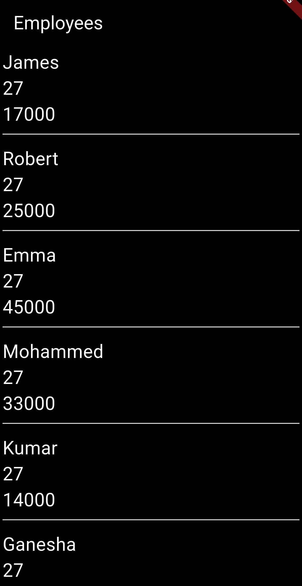
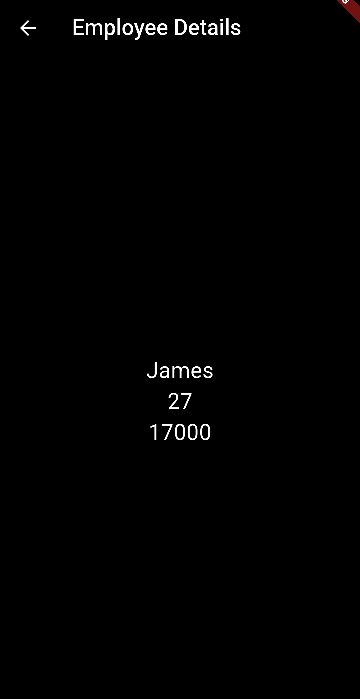

# Employee Directory App

A simple Flutter application that displays a list of employees and allows users to view employee details by tapping on an employee card.

## Features

- Display a list of employees
- Navigate to employee details screen
- Pass complete employee data using model objects
- Clean and reusable widget structure
- Dark theme UI
- Responsive card tap interaction using InkWell

---

## Screenshots

### Employee List Screen



### Employee Detail Screen



---

## Project Structure

```text
lib/
│
├── src/
│   ├── model/
│   │   └── employee_model.dart
│   │
│   ├── screen/
│   │   ├── employee_list_screen.dart
│   │   └── employee_detail_screen.dart
│   │
│   ├── utilis/
│   │   ├── employee_card_widget.dart
│   │   └── textStyle_widget.dart
│
└── main.dart
```
